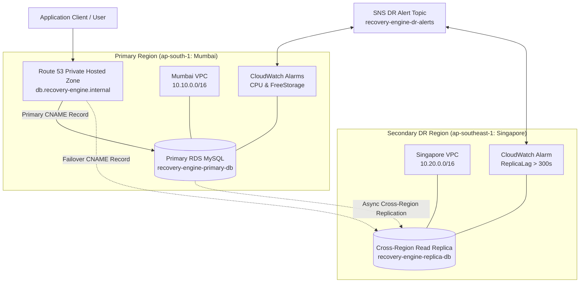
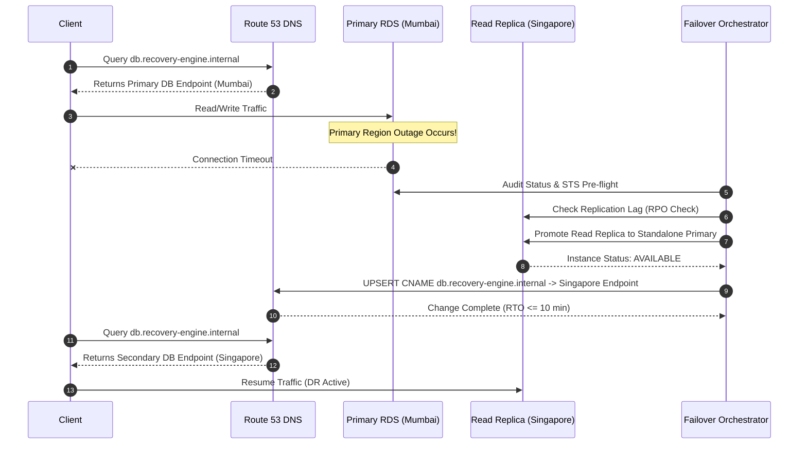

# 🌍 Recovery-Engine-AWS: Architecture & Operational Runbook

Reference implementation for a production-grade **Active-Passive Multi-Region Disaster Recovery System** built on AWS, Terraform, and Python.

---

## 🎯 Target Service Level Objectives (SLOs)

* **Target RTO (Recovery Time Objective):** $\le 10$ minutes  
  *(Measured time from outage detection to database replica promotion, Route53 DNS cutover, and endpoint reachability restoration)*
* **Target RPO (Recovery Point Objective):** $\le 5$ minutes  
  *(Maximum acceptable data loss window based on RDS Cross-Region Replication lag)*

---

## 🏗️ System Architecture Diagrams

### 1. Multi-Region Active-Passive Architecture



---

### 2. Disaster Recovery Failover Sequence



---

## 📂 Repository Module Architecture

| Module | Location | Purpose & Features |
| :--- | :--- | :--- |
| **Module 1 — Foundation** | [`modules/networking`](file:///D:/Projects/Recovery-Engine-AWS%20Multi-Region%20Disaster%20Recovery%20System/modules/networking), [`modules/iam`](file:///D:/Projects/Recovery-Engine-AWS%20Multi-Region%20Disaster%20Recovery%20System/modules/iam) | Multi-Region VPCs, public/private subnets, IAM baseline roles & policies. |
| **Module 2 — Data Layer** | [`modules/rds_primary`](file:///D:/Projects/Recovery-Engine-AWS%20Multi-Region%20Disaster%20Recovery%20System/modules/rds_primary), [`modules/rds_replica`](file:///D:/Projects/Recovery-Engine-AWS%20Multi-Region%20Disaster%20Recovery%20System/modules/rds_replica) | RDS MySQL Primary (Mumbai) + Cross-Region Read Replica (Singapore). |
| **Module 3 — Failover Routing** | [`modules/route53_failover`](file:///D:/Projects/Recovery-Engine-AWS%20Multi-Region%20Disaster%20Recovery%20System/modules/route53_failover) | Private Hosted Zone (`recovery-engine.internal`) & CNAME failover policy records. |
| **Module 4 — Orchestration** | [`scripts/failover_orchestrator.py`](file:///D:/Projects/Recovery-Engine-AWS%20Multi-Region%20Disaster%20Recovery%20System/scripts/failover_orchestrator.py) | Live Python failover engine, health verification, and failback controller. |
| **Module 5 — Monitoring** | [`modules/monitoring`](file:///D:/Projects/Recovery-Engine-AWS%20Multi-Region%20Disaster%20Recovery%20System/modules/monitoring) | SNS topic, CloudWatch CPU/Storage/ReplicaLag alarms & multi-region dashboard. |
| **Module 6 — Validation** | [`scripts/chaos_simulator.py`](file:///D:/Projects/Recovery-Engine-AWS%20Multi-Region%20Disaster%20Recovery%20System/scripts/chaos_simulator.py) | Chaos scenario simulator, RTO/RPO audit reporter, and Game-Day drill orchestrator. |
| **Module 7 — Packaging** | [`config/schema.json`](file:///D:/Projects/Recovery-Engine-AWS%20Multi-Region%20Disaster%20Recovery%20System/config/schema.json) | JSON Schema loader, zero-hardcoding scanner, and `environments/prod_example`. |

---

## 🕹️ Standard Operating Procedures (SOPs)

### 1. Pre-Deployment Validation
```bash
# Validate configuration schema and audit zero-hardcoding compliance
./scripts/run_failover.sh validate-config
./scripts/run_failover.sh audit-tf
./scripts/run_failover.sh audit-modules
```

### 2. Multi-Region Health Audit
```bash
./scripts/run_failover.sh status
./scripts/run_failover.sh check
```

### 3. Automated Game-Day DR Drill Simulation
```bash
./scripts/run_failover.sh gameday
```

### 4. RTO & RPO Benchmark Report Generation
```bash
./scripts/run_failover.sh audit
```
*(Generates markdown report at [`docs/RTO_RPO_Audit_Report.md`](file:///D:/Projects/Recovery-Engine-AWS%20Multi-Region%20Disaster%20Recovery%20System/docs/RTO_RPO_Audit_Report.md))*

---

## 💰 Cost Optimization & Teardown Policy

* **Database Engine:** `db.t4g.micro` (eligible for AWS Free Tier).
* **Teardown Command:** Always tear down sandbox infrastructure when drills complete:
  ```bash
  cd environments/dev
  terraform destroy -auto-approve
  ```
